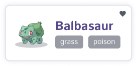
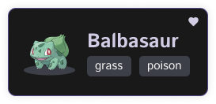
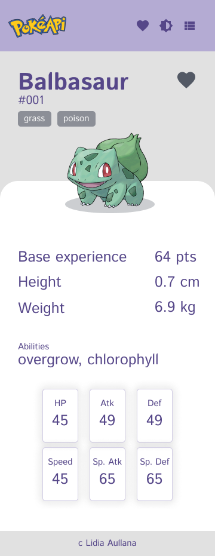
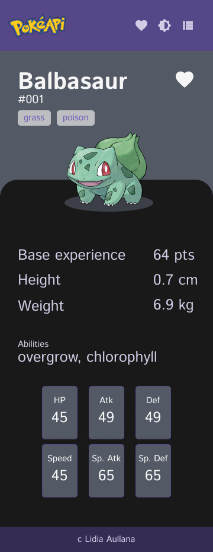

# Pokedex

## Descipción

Se solicita la creación de una app que cargue una extensa lista de pokemons, que tenga un modo claro y otro oscuro y que la disposición de los elementos se pueda cambiar de modo lista a modo cuadrícula. Para acometer este proyecto, se han empleado las siguientes herramientas:

+ [React y Vite](https://vitejs.dev/guide/)

+ [React-router](https://reactrouter.com/en/main/start/tutorial)

+ [PokeApi - documentación](https://pokeapi.co/docs/v2)

+ [Vitest](https://vitest.dev/guide/)

+ [Jsdom](https://www.npmjs.com/package/jsdom)

+ [Testing-library](https://testing-library.com/docs/)


## Análisis y diseño

Partiendo de la estructura básica de páginas que se quiere utilizar y de algunas webs de documentación sobre pokemons, se comienza a estudiar y analizar la propia API de pokemon para extraer la estructura de toda la información que se va a solicitar:

+ [Documentación propia de la API](https://pokeapi.co/docs/v2)
+ [Web de documentación de pokemons](https://pokemon.fandom.com/es/wiki)
+ [Web oficial de pokedex de pokemon](https://pokemon.com/es/pokedex)

Partiendo de los resultados previos, se comienzan a realizar algunos bocetos de diseño para organizar toda la información obtenida:

<div style='display: flex'>
    
    
</div>

<div style='display: flex'>
    
    
</div>


## Programando la pokedex

+ Creación de una app con [React y Vite](https://vitejs.dev/guide). Se ha seleccionado esta librería debido a su versatilidad al poder reutilizar componentes y renderizar solo algunas partes de la pantalla.

+ Estructura de datos utilizando [react-router](https://reactrouter.com/en/main/start/tutorial) para crear las páginas. Mediante esta librería se consiguen crear páginas y enlazarlas unas con otras de forma fácil y rápida. También es sencillo crear una vista de layout que contenga una barra de navegación superior y un footer que estén presentes en el resto de vistas sin tener que repetir esta estructura en cada archivo.

+ Creación de un contexto para alojar los datos de la API y otra información general relevante. [Web de referencia](https://react.dev/reference/react/createContext). Se ha creado un contexto que permite conectar algunas variables entre los diferentes archivos para que toda la aplicación sea coherente y consistente.

+ Anidación de promesas al hacer la petición a la API para guardar los datos de los diferentes pokemons. Mediante esta anidación, se consigue solicitar un listado de pokemons a la APi correspondiente y mediante un bucle, extraer más información sobre cada uno de los pokemons. Se puede ver el fragmento de código a continuación:

    ```
    useEffect(() => {
        fetch(`https://pokeapi.co/api/v2/pokemon?offset=${actualOffset}&limit=${limitSearch}`)
        .then(res => res.json())
        .then(data => {
            data.results.map(item => {
            fetch(item.url)
                .then(res => res.json())
                .then(pokeInfo => {
                if(!arr.find(item => item.id == pokeInfo.id)) {
                    arr.push(pokeInfo)
                }
                if(arr.length === limitSearch) {
                    setPokeList(arr.sort((a, b) => a - b))
                }
                })
            })
        })
    }, [actualOffset])
    ```

    Como se puede ver, se guardan los datos en un nuevo array más completo para después pintar los datos que sean necesarios. Dichos datos son pintados ordenados de menor a mayor según la Id de cada pokemon. [Web de referencia](https://medium.com/@netocruz_55767/react-pokedex-usando-fetch-anidado-16d269aa3693)

+ Se ha realizado también la paginación de los resultados utilizando una variable límite que permite cargar el número de datos que se quieran y no el valor por defecto de la API. Para ello se ha utilizado otra variable que controla el offset de los mismos. [Web de referencia](https://codesandbox.io/s/webdevsimplifieds-react-pokemon-pagination-ke6qh?file=/src/App.js)

+ Se ha añadido un botón que cambia el tema de modo claro a oscuro. Mediante el context API creado, se permite guardar el valor del tema y renderizarlo en una clase sobre el body. Gracias a esto, es sencillo cambiar el modo de color de claro a oscuro utilizando clases de CSS y variables de SASS

+ Se ha añadido la opción de cambiar la visualización de grid a list. De la misma forma que se cambiaba el color del tema, se ha creado la opción de cambiar la disposición de los elementos listados. El funcionamiento es el mismo: se guarda el valor en el contexto y mediante variables CSS y SASS, se renderiza el valor correspondiente.

+ Se ha añadido la opción de guardar como favoritos algunos pokemons. Se pueden añadir y eliminar de favoritos tanto desde la vista de listado como de la de detalle. Igualmente se pueden ver todos los pokemons guardados como favoritos en una nueva página. Mediante el context API, es fácil guardar un listado de aquellos pokemons que se han establecido como favoritos. Mediante un simple botón, se ejecuta una función que setea un nuevo pokemon como favorito o lo elimina si ya existe previamente en la lista.

+ Los valores de theme, layout y pokemons favoritos han sido guardados en local para que al refrescarse la página, estos permanezcan inalterables. Mediante la propiedad ```localStorage```, se puede acceder fácilmente al objeto Storage y guardar o extraer datos de él. De esta forma, es sencillo guardar valores para su posterior utilización.

+ Se ha creado un componente de Loading para indicar que los datos se están cargando. Es común que al ejecutar acciones, el estado de la pantalla tarde unos segundos en cargar el contenido final por lo que mediante este componente, el usuario estará continuamente informado de lo que está ocurriendo en pantalla.

## APIs

Para crear esta app, se ha hecho uso de la api de [PokeAPI](https://pokeapi.co/docs/v2). Esta api devuelve un listado de veinte pokemons. De cada uno de ellos tan solo se devuelve su nombre y una url en la que se encuentra más información sobre el mismo. Con esta información, se hace uso de la petición anidada que se explicaba anteriormente para extraer en un solo array todos los datos importantes sobre cada pokemon. Además, utilizando la siguiente petición: ```https://pokeapi.co/api/v2/pokemon${nombre del mismo}```, se puede acceder a los datos de un pokemon en concreto y extraer la información pertinente.

Mediante el la siguiente petición ```https://pokeapi.co/api/v2/pokemon?offset=${actualOffset}&limit=${limitSearch}``` se puede acceder a un de pokemos distinto a los veinte primeros. Esto facilita la paginación y hace que la web sea más rápida. 

## Estructura de información

+ ```src```: Incluye todos los archivos creados para la app y se estructuran de la siguiente manera:
    + ```components```: Incluye, organizados por carpetas, todos los componentes que se han creado. Cada uno de ellos dispone de su propio archivo de estilos y su propia lógica. Se pueden visualizar todos ellos en el storybook del proyecto.

    + ```scss```: Incluye todos los estilos globales de la app, todos oganizados por carpetas que se importan en el archivo ```global.scss```.

    + ```views```: Incluye las vistas de la todas las páginas. Layout corresponde a la vista general que incluye los componentes de Topbar y Footer. El resto de vistas son las correspondientes a cada página y que se cargan dentro de la vista Layout.

+ ```tets```: En esta carpeta se incluyen todos los archivos de testing y sus configuraciones.


## Testing

Se han creado tests para comprobar que las páginas de vistas se renderizan de forma correcta y que los valores preestablecidos se guardan correctamente en el alojamiento local. Sin haber creado nunca ningún test, he querido incluir alguna prueba para comenzar a introducirme en esta materia. Para craer estos tests se han necesitado las librerías [testing-library](https://testing-library.com/docs/), [vitest](https://vitest.dev/guide/) y [jsdom](https://www.npmjs.com/package/jsdom). Se trata de tests muy sencillo que dan como resultado el conocimiento de que las diferentes vistas se renderizan de forma correcta y que los datos que se pretenden guardar el el alojamiento local, lo hacen sin errores.

## Resultado final

Tras todo el proceso, el resultado obtenido es un proyecto completo y coherente, fácil de utilizar y muy funcional:


[Demo del proyecto en netlify](https://lidiaa3pokedex.netlify.app/)