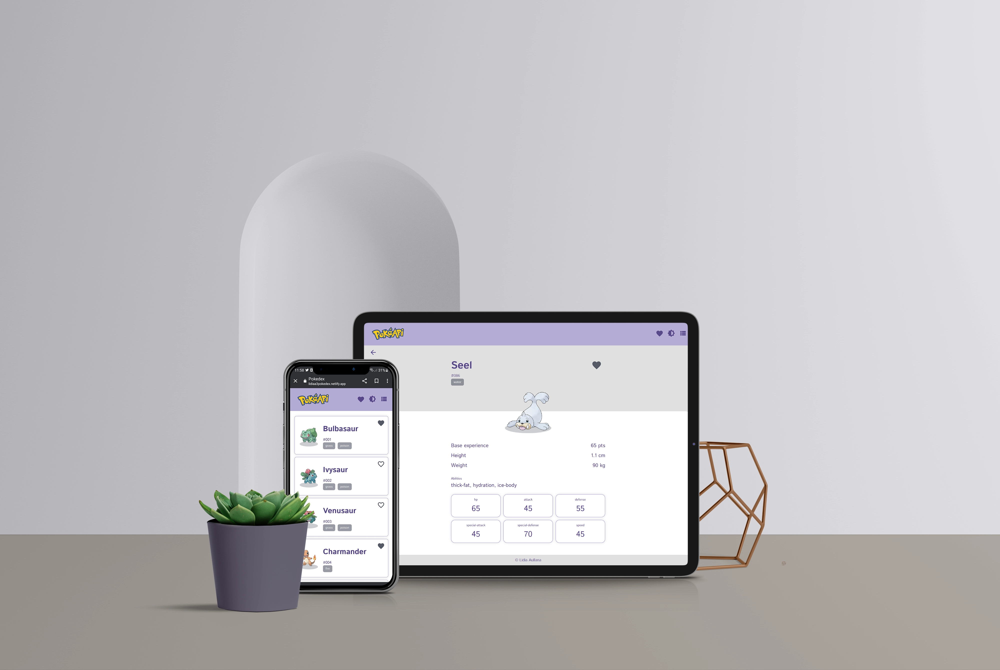

# Pokedex - pokemons in the Sinnoh region

Pokemon App where you can find relevant information about all the pokemon that live in the Sinnoh region.



[Whatch the demo of this project](https://lidiaa3pokedex.netlify.app/)

---

## Features

+ Context api allowing variables to be saved for use in different views.

+ Nesting promises using fetch to extract all relevant data from the api.

+ Pagination of results to load all pokemon available in the api.

+ Option button that allows you to change the theme from light to dark.

+ Option button that allows you to change the layout list display from grid to list.

+ Option to save some pokemon as favourites and display them in a new view.

+ Local storage of theme, layout and favourite pokemon variables so that they are available even if the page is reloaded.

+ Loading component to alert the user that the page is processing the data for diplay.

+ Error component and error page to alert teh user that something went wrong.

+ Creation of tests to check that the view pages are rendered correctly and that the preset values are saved correctly on the local storage.

---

## Contents structure

```jsx
│   .eslintrc.cjs
│   .gitignore
│   Documentation.md
│   index.html
│   package-lock.json
│   package.json
│   README.md
│   vite.config.js
│
├───public
│   │   mockup_pokedex.webp
│   │   pokeapi_logo.png
│   │   pokemon_icon.png
│   │
│   └───fonts
│           IstokWeb-Bold.woff
│           IstokWeb-Regular.woff
│
├───src
│   │   main.jsx
│   │
│   ├───components
│   │   ├───button
│   │   │       Button.jsx
│   │   │       Button.scss
│   │   │
│   │   ├───card
│   │   │       Card.jsx
│   │   │       Card.scss
│   │   │
│   │   ├───footer
│   │   │       Footer.jsx
│   │   │       Footer.scss
│   │   │
│   │   ├───icon
│   │   │       Icon.jsx
│   │   │
│   │   ├───loading
│   │   │       Loading.jsx
│   │   │       Loading.scss
│   │   │
│   │   └───topbar
│   │           Topbar.jsx
│   │           Topbar.scss
│   │
│   ├───scss
│   │       global.scss
│   │       _font-family.scss
│   │       _functions.scss
│   │       _links.scss
│   │       _mixins.scss
│   │       _typography.scss
│   │       _utilities.scss
│   │       _variables.scss
│   │
│   └───views
│       ├───detail
│       │       Detail.jsx
│       │       Detail.scss
│       │
│       ├───errorpage
│       │       ErrorPage.jsx
│       │       ErrorPage.scss
│       │
│       ├───favourites
│       │       Favourites.jsx
│       │
│       ├───home
│       │       Home.jsx
│       │       Home.scss
│       │
│       └───layout
│               Layout.jsx
│               Layout.scss
│
└───tests
        localStorage.test.jsx
        renderViews.test.jsx
        setup.js
```

---

## Getting started

In order to run this project on your machine you must have [Git](https://git-scm.com/downloads) and [Node.js](https://nodejs.org/es/download) (which comes with [npm](https://www.npmjs.com/)) installed.

To implement it just follow the next steps:

```jsx
    # Clone the repository
    git clone https://github.com/LidiaA3/pokedex.git

    # Go to the directory
    cd pokedex

    # Install the dependecies
    npm install
```

You can then type the following command to run the project in local: 

```jsx
    npm run dev             # Run the project in local
```

---

## Testing

Tests have been carried out to ensure the correct rendering of the views and the correct local saving of the data.

You can then type the following command to run the tests of this project:

```jsx
    npm run test
```

---

## Deployment

For deploy the project on a server, just run the following command and push the dist file to server:

```jsx
    npm run build
```

---

## Built with

This project is built using [react and Vite](https://vitejs.dev/guide/) with javascript logic.

The routes of the different views have been loaded using [react-router](https://reactrouter.com/en/main/start/tutorial).

The API used to extract the list of pokemons and all details is documented in the following link:

[PokeApi - documentation](https://pokeapi.co/docs/v2)

In addition, hooks, context API and other react resources have been used.

---

## Author

Made with ❤️ by [LidiaA3](https://github.com/LidiaA3)

Thank you very much for visiting this repo and feel free to fork or make a pull request. I will be happy to approve new contributions.